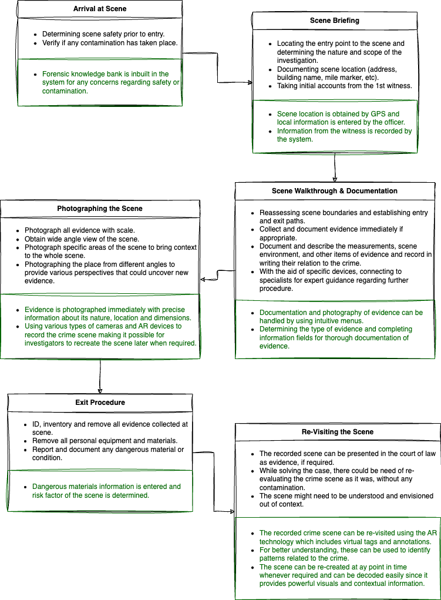

If you're a Sherlock Holmes geek like me, you'll likely find this project as fascinating as I did. And even if you're not a fan, let's admit it – it's difficult not to be impressed by the power of deduction. 

Bear with me, and picture this: a crime scene as a cryptic novel, waiting to be deciphered. Now, add Augmented Reality to the narrative — a digital detective donning smart lenses, leading us on a virtual exploration, or perhaps crafting a 3D reconstruction of the mystery at hand. This isn't your typical detective story; this is a technological non-fiction where reality and augmentation intertwine, promising a new era in forensic investigation.

With the goal of enhancing early investigation methods, this paper explored the Augmented Reality (AR) technologies that could be integrated, potentially transforming Crime Scene Investigation (CSI) approaches.

### Introduction
In a crime scene, encoded by marks and traces, the scattered state must be meticulously assembled and analyzed to unveil the train of events leading to the crime. Essential pieces of evidence, like DNA-containing hair and nails, blood traces, or gunshot residue, demand careful analysis and interpretation. 

The initial responder, often the first officer on the scene, plays a crucial role as the evidence is uncontaminated at that point. However, due to constraints such as time, cost, and geography, sending the most qualified personnel _(cue Sherlock & Watson)_ may not always be feasible. 

Augmented Reality (AR) comes into play by providing prototypes to the first officer, allowing them to explore and record the crime scene. This AR version can be transmitted to experts remotely, minimizing contamination risks and facilitating analysis. The recorded data holds potential for courtroom use, and the unrealized power of AR lies in its ability to recreate a crime scene for a jury.

### Flowchart 

Here is a flowchart illustrating the standard sequence of events that unfolds once a location is identified as a crime scene, augmented (_see what I did there? xP_) with possible improvements through the integration of augmented reality (AR).

Colors in the chart:

_Black - Conventional Methods,_ 

_Green - post-AR Integration_
{style="color: green"}

### AR Technologies studied:
#### 1. HoloLens

#### 2. Google Glass

#### 3. Smart Lenses

### Possible Challenges
Throughout my research, it was clear that the AR technology had progressed significantly but still faces challenges in online annotations, including perceptual and positioning issues. The choice between hand-held and head-mounted devices influences user experience, and challenges exist with GPS-based location information indoors. Proposed solutions involve a vision-based positioning system and potential improvements in user interaction through free-hand gestures using depth-sensing cameras.

{}
This research is dated 2018, and while some products may have been discontinued, they were cutting-edge at the time. Since then, there have been numerous noteworthy advancements and alterations in these technologies and how they are applied.
{}