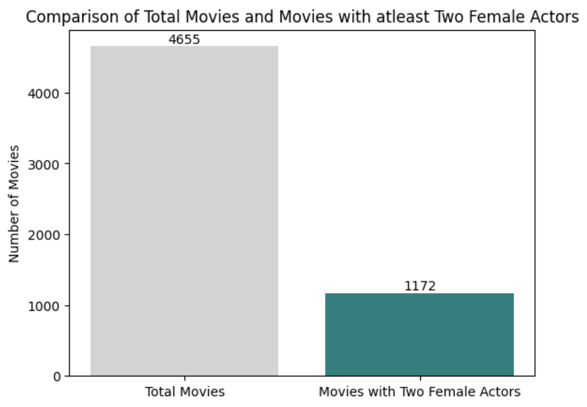

### Introduction
Before we begin, since we're talking about movies, imagine the following scene -

Two women discussing movies; one remarks that she will only see a film if it meets a certain set of requirements involving female characters and their depiction.

This exact dialog that started as a joke in one of Alison Bechdel's comic strip - “Dykes to Watch Out For”, sparked a critical conversation and often comes up when thinking about female representation in media.

**What exactly is the Bechdel Test?**

It is a 3-question litmus test to gauge gender bias in movies. These are fairly basic questions -

1. The movie must feature at least two women in it.  
2. The women must talk to each other.  
3. Their discussion must be about something other than a man.  

Simple, right?

Well, a surprising number of movies do not pass this simple test!

To name a few -
- Bullet Train
- Dead Poet's Society
- Slumdog Millionaire
- The Lord of the Rings trilogy
- The Prestige
- The Shawshank Redemption

As aggravating it is, I found the concept incredibly fascinating and decided to tinker with the data myself and see how it turns out!

### Insights

**1. Distribution of total movies release each year and the movies that pass the first rule of the Bechdel Test**

**2. Movies featuring atleast Two Female actors**

**3. Percentage of movies that pass the first rule of the test directed by each gender**

### Thoughts
The Bechdel Test first appeared in the comic in 1985. Almost 40 years on, we're not exactly doing very well addressing the core gender inequalities.

### Data

**Dataset Sources:**
- [Top 10,000 IMDb Movies (1915 - 2023)](https://www.kaggle.com/datasets/willianoliveiragibin/10000-data-about-movies-1915-2023/data)

- [Actors' Gender](https://github.com/taubergm/HollywoodGenderData/blob/master/all_actors_movies_gender_gold.csv)

- [Directors' Gender](https://github.com/taubergm/HollywoodGenderData/blob/master/all_directors_gender.csv)

