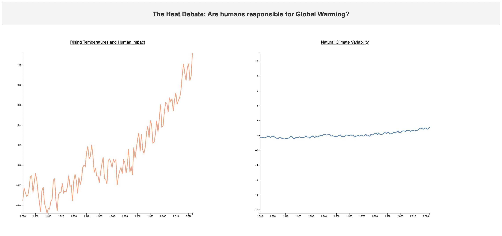
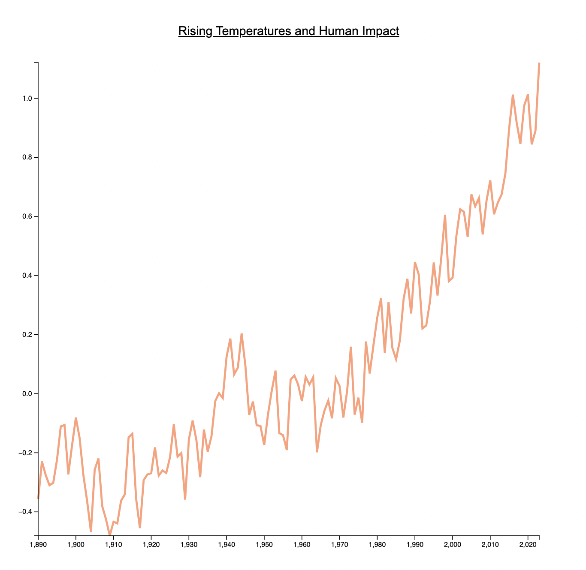
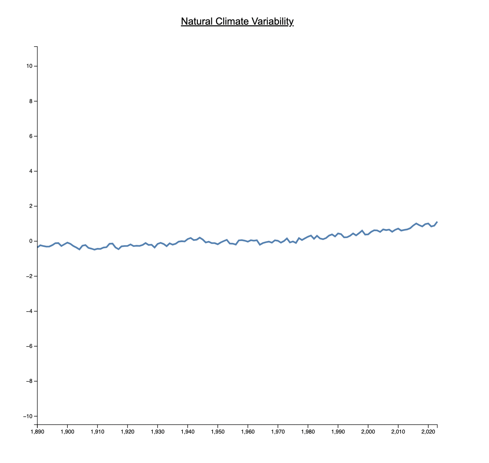

### Introduction

Take a quick look at the two graphs below. 

What do you see? What is the first thing that you notice?

You probably thought that the graph on the left is steeply rising and the graph on the right is relatively constant.

What if I told you that both of these graphs are created using the same data?

Surprising, right? Take a minute and think about how is this possible.

I did this project as a part of an assignment for the course CSE 578 - Data Visualization I took during my Master's degree. The main aim of the assignment was to think outside the box and create two charts to demonstrate contrasting views. The challenge here was to use the exact same dataset for both.

I chose to present contrasting perspectives on Global Warming to examine the rate at which climate change has unfolded over the last century and derive insights into whether it is caused by human activities or simply natural climate fluctuations. 

I use a couple of Rhetoric/Framing techniques to make the visualization appealing and effectively convey my point.

**Why Global Warming?**

Climate change and global warming are controversial topics, with debates centering around the extent of human influence, the urgency of action, and the potential consequences. Proponents of immediate action argue that human activities are driving climate change with severe consequences, while skeptics may question the extent of human impact or the reliability of climate models.

Let's go back to the charts and look at each of them closely now, shall we?

### Left Chart

This chart visualizes rising global temperatures over time, emphasizing the correlation with human activities. 

It argues that humans have made significant damaging contributions to climate change and temperatures are in fact rising sharply, implying the urgency of the matter and immediate call-to-action.

Some notable events that indicate strong human contribution are:
1.  The sharp rise in graph post World War II in 1939-1945, likely due to substantial increase in urbanization, modernization and industrialization.
2. We also see a high spike in the temperatures in 2011, that is when the Fukushima disaster occurred - yet another human-induced tragedy.

### Right Chart

Contrastingly, the right chart takes a broader perspective and showcases a relatively stable graph, indicating that it's not a real threat. 

It tends to speak for the natural ebb and flow of climate conditions, suggesting that current warming trends may be part of a larger natural cycle rather than solely due to human influence.

### Rhetoric/Framing Techniques
#### 1. Y-Axis Scale Range: 
The scale for the y-axis for both the charts is different. 

The scale for the chart on the left is fitted precisely to the minimum and maximum values in the dataset thus offering a detailed, microscopic view of the plot. 

On the contrary, the scale for the right chart extends far beyond the dataset's extreme values. This creates the illusion of minimal variation in the graph, suggesting a relatively stable trend.
#### 2. Color Scheme: 
The color palette for both charts is thoughtfully selected, intentionally creating a subconscious mental bias. 

The left chart is drawn with a vibrant, warm red color, instilling a sense of urgency and suggesting potential negative impacts. 

Conversely, the right chart is presented in a natural, earthy, and tranquil blue tone, encouraging a more relaxed interpretation.

### Data

**Dataset Source:**
 [NASA's Climate Change Data](https://data.giss.nasa.gov/gistemp/)

From the link above, navigate to:  

Tables of Global and Hemispheric Monthly Means and Zonal Annual Means **->**   

Combined Land-Surface Air and Sea-Surface Water Temperature Anomalies **->**   

Global-mean monthly, seasonal, and annual means, 1880-present, updated through most recent month _CSV_.

**Data pre-processing**

Both charts utilize identical data.
1. Values from the year 1980 onwards.
2. Values for each month (Jan-Dec) are aggregated to calculate the annual mean. The line charts represent the mean value for each year.