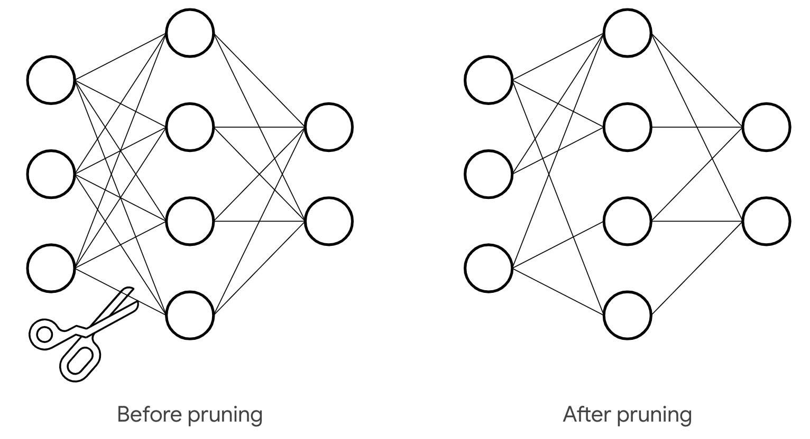
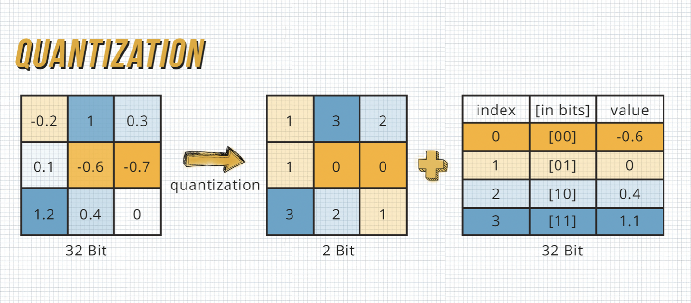
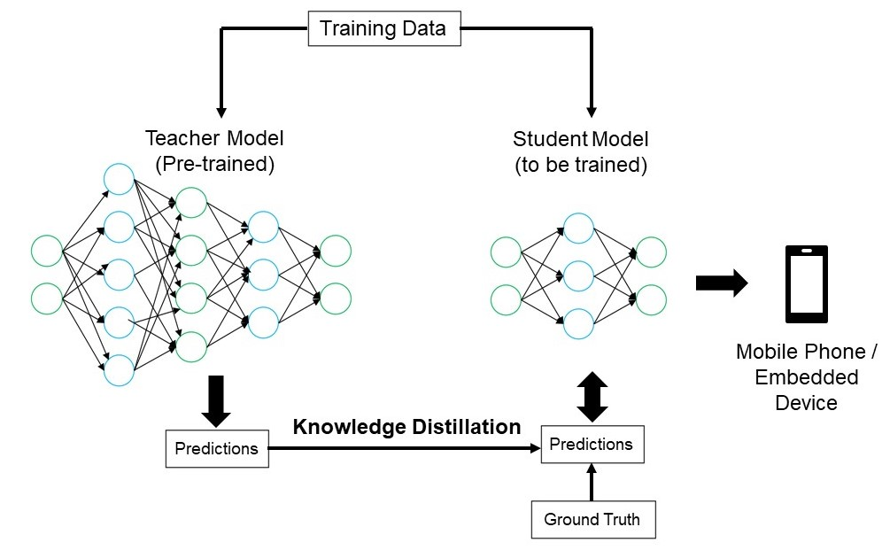

### Introduction

Deep Neural Networks (DNNs) have revolutionized various fields, from image recognition to natural language processing. Yet, their sheer size and computational demands pose challenges, especially for deployment on devices like mobile phones and embedded systems. Enter model compression techniques – the key to increasing efficiency without compromising on performance.

Here, we dive into DNN compression, aiming to bridge the gap between cutting-edge technology and practical deployment. We explore three main techniques: 

- Network Pruning, 
- Quantization,  
- Knowledge Distillation

Each of these offer unique solutions to the challenge at hand.

#### 1. Network Pruning:

This method scultps away the excess, leaving only what's essential. Network Pruning trims down redundant parameters while preserving accuracy. It does so by systematically removing less impactful components like neurons or filters, we achieve remarkable reductions in model size and inference time.

#### 2. Quantization:

Precision meets efficiency through Quantization. By reducing the bit-width of weights and activations, we optimize memory usage and computational complexity. Whether through post-training compression or quantized aware training, the results speak volumes – smaller models, faster inference, and minimal loss in accuracy.

#### 3. Knowledge Distillation:

Here, the student learns from the master. Knowledge Distillation transfers insights from a larger, more complex model to a leaner counterpart, enabling faster training and lower memory requirements. Fine-tuning temperature controls the balance between accuracy and generalization, paving the way for smarter, more efficient models.

### Use Cases
- Computing in Space
- Deployment to Edge Devices (e.g. mobile phones)

### Conclusion
Through meticulous experimentation and analysis, we've explored the power of these techniques. From scheduled pruning strategies to dynamic quantization approaches, each method offers a unique pathway to efficiency. By combining these techniques, we sprint quickly towards optimal performance, minimizing trade-offs and maximizing utility.

As we look to the future, the possibilities are limitless. From exploring new datasets like CIFAR-10 to testing scalability with larger models, combining multiple techniques and pushing the boundaries of innovation, we aim to further improve efficiency.

In the ever-evolving landscape of deep learning, one thing is clear – efficiency is the key to unlocking the full potential of AI, making it accessible to all, regardless of device or resource constraints. With model compression techniques leading the charge, the future of AI is brighter than ever before.
